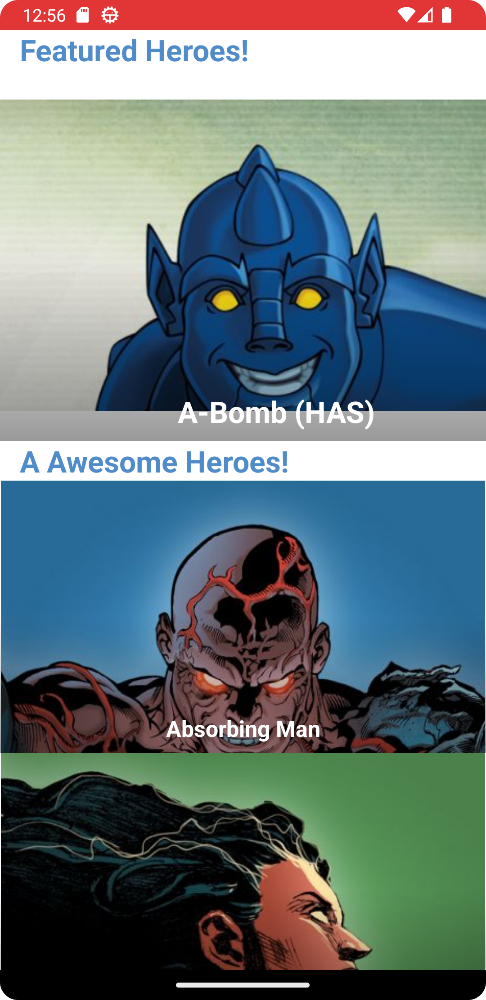
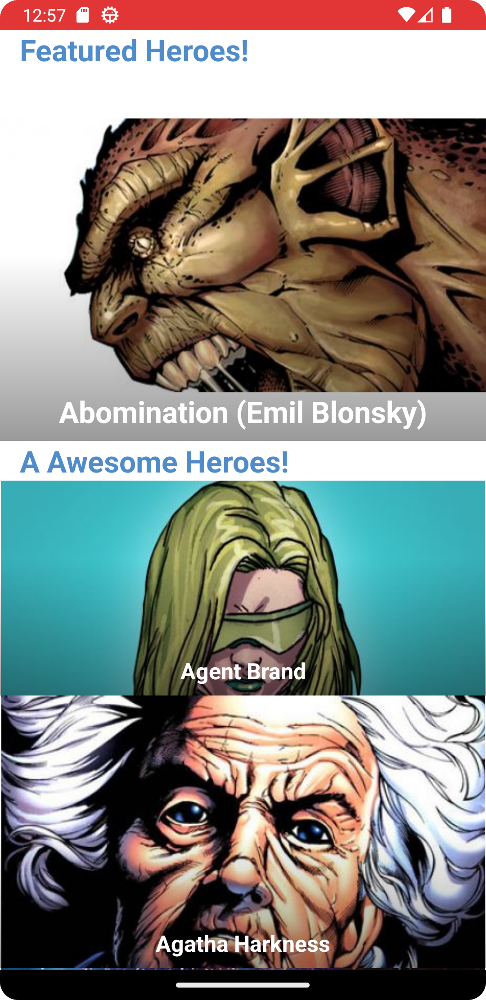

# My Marvel Heroes

## Fluxo de pensamento

Montei o app pensando primeiramente na camada de domain do app, onde ficam os models utilizados pelo
app.
Após isso, montei as interfaces e implementações dos data sources e repositories referentes ao
models
criados. Implementei o service e local database necessários para o funcionamento da camada de dados
do app.
Fiz TDD na camada de dados do app. E para finalizar, montei a UI com os requisitos.

## Screenshots

## Bibliotecas usadas

Room: 2.6.0-alpha01
Koin: 3.4.0
Glide: 4.15.1
Coroutines: 1.7.1
Retrofit: 2.9.0
Paging: 3.1.1
Jama CarouselView: 1.2.2
Mockito: 5.3.1
Mockk: 1.13.5
JUnit: 4.13.2

## Roadmap de features

- Página de detalhes dos personagens
- Filtro de personagens por nome, quadrinho e favoritos
- Visualizador de HQs dos pesonagens

## Melhoras que gostaria de fazer

- UI mais bem trabalhada com auxílio de um designer de produtos
- Implementar animações de transição entre telas
