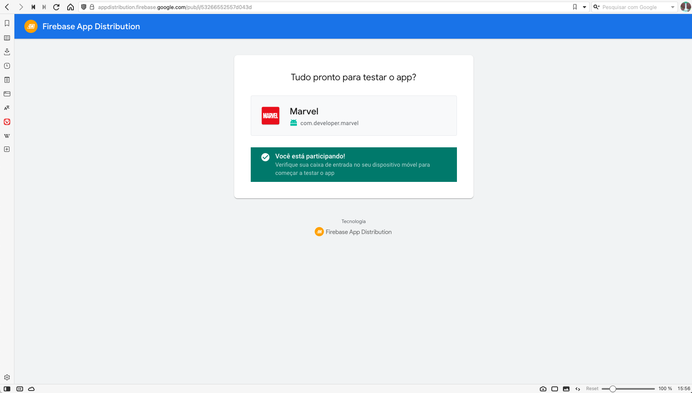
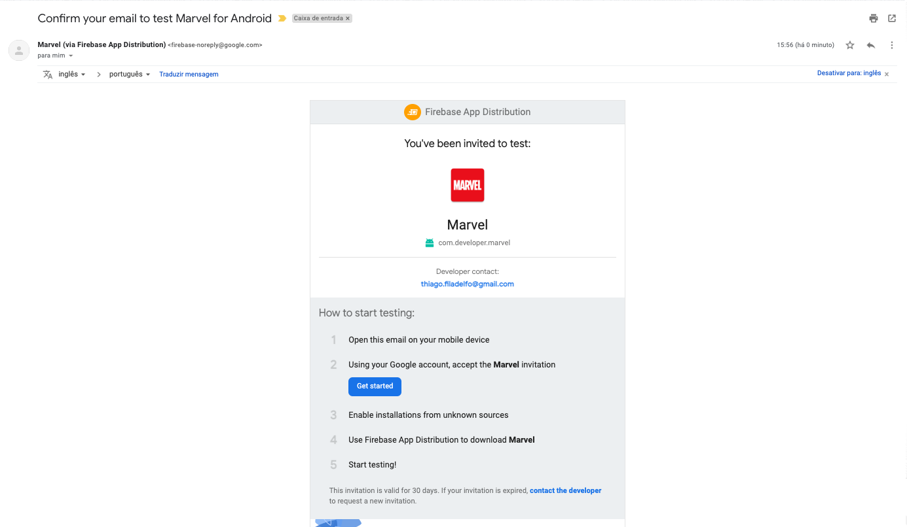
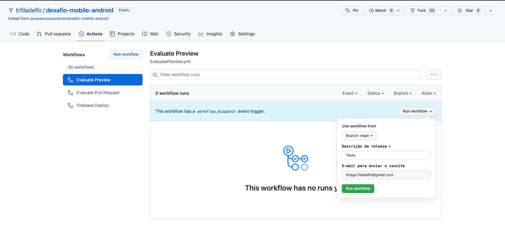

# TheMovies

Desafio técnico para Serasa, cuja proposta é desenvolver um aplicativo que realiza a listagem de personagens da Marvel.

😀 Thiago Ribeiro Filadelfo - thiago.filadelfo@gmail.com

📅 Entregue em 02/08/2022

## Atividades
- [x] Criação do repositório
- [-] [Wireframe de baixa fidelidade](https://www.figma.com/file/dBwqzILYichLDF5F2xHXSo/MarvelApp?node-id=0%3A1)
    - [x] Lista de personagens top 5
    - [x] Lista de personagens populares 
    - [x] Detalhamento do personagem selecionado

## Minhas considerações
Para a execução deste desafio técnico escolhi utilizar algumas abordagens mais contemporâneas, com a arquitetura limpa com pattern do MVVM, binding e Coroutines. E para o meu espanto eu codifiquei bem menos do que estava imaginando, gostei muito do resultado.

Também me desafiei para tentar colocar o máximo possivel de animação e pensar bastante em usabilidade, mais especificamente na inclusão de acessibilidade.

Durante o desenvolvimento tive pratiquei o modelo de DDD para desenvolver a feature, gostei bastante do resultado e observei que é possivel garantir a qualidade do desenvolvimento sem ter ao menos um teste de tela.

Em suma esse desafio encarei como um hackton individual cujo o objetivo final da jornada ter insumo para apresentar e validar os conceitos utilizados.


## Como executar?
- Pré-requisito:
    - Git/Github instalador
    - Ter Android Studio instalado: 2021.1.1 ou maior
    - Utilizar Gradle na versão: 7.2 ou maior
    - BuildTools na versão: 31.0.0 ou maior
    - Aplicativo compatível com o Sistema operacional Android API 21 ou maior

- Instalação do projeto:
    ```
    $ git clone https://github.com/trfiladelfo/desafio-mobile-android.git
    ```
    - Abrir o Android Studio na pasta onde foi realizado o clone
    - Clique em Run -> App

## Bibliotecas usadas
- [Android X - Jetpack](https://developer.android.com/jetpack)
    - Navigation: Manipulador de navegar entre fragments e activities
- [Firebase](https://firebase.google.com/?hl=pt-br): Biblioteca ampla de recursos, o principal dele é o crash analytics e autheticator
- [Retrofit2](https://square.github.io/retrofit/): Biblioteca para realizar requisições Rest
- [Glide](https://bumptech.github.io/glide/): Biblioteca para manipular imagens
- [Koin](https://insert-koin.io/): Biblioteca para injeção de dependência
- Bibliotecas diversas
    - [Scrollingpagerindicator](https://github.com/Tinkoff/ScrollingPagerIndicator): Componente controlador para exibir os indicadores do slide
    - [Shimmer](http://facebook.github.io/shimmer-android/): Componente gráfico para realizar o placeholder de uma lista

## Para testar
- Teste da execução do aplicativo:
Adicione o seu e-mail cadastrado no Google Play no endereço do [App Distribution](https://appdistribution.firebase.dev/i/53266552557d043d) e verifique na caixa de entrada um e-mail com as seguintes informações:
 - titulo: Confirm your email to test Marvel for Android
 - remetente: Marvel (via Firebase App Distribution) <firebase-noreply@google.com>





Realize os procedimentos descritos no e-mail

- Teste para execução dos testes unitários
  ```
   $ ./gradlew test -p
  ```
  ou
  ```
    $ bundle exec fastlane android test
  ```
  
- Teste realizar uma distribuição
  ```
   $ bundle exec fastlane android beta app_id:"1:41836561468:android:bd422822350b0707daaf39" notes:"Teste de Distribuição" firebase_token:"1//0h_ciribHjLbUCgYIARAAGBESNwF-L9IrrRmiweamnFW3xo_tH8kYwmFbZTkXIrLp3KFFr4WJ8USIjSKIR5fz9lG1IPTF9CQ32uQ"
  ```
  Para mais informações, deixei um documento detalhando o processo neste [link](fastlane/README.md)

Obs: 
1. Cada commit realizado foi "trigado" a cada PR no Github Actions o script de validação do commit e posteriormente o PR
2. Pelo Github action é possivel também realizar um release 


## Prévia
[Previa](docs/desafio.gif)

## Obrigado!
Agradeço muito pela oportunidade e ficarei muito grato pelo retorno de vocês acerca da minha execução independentemente do resultado final, isso nos engrandece como pessoa e mais ainda como um melhoramento profissional.