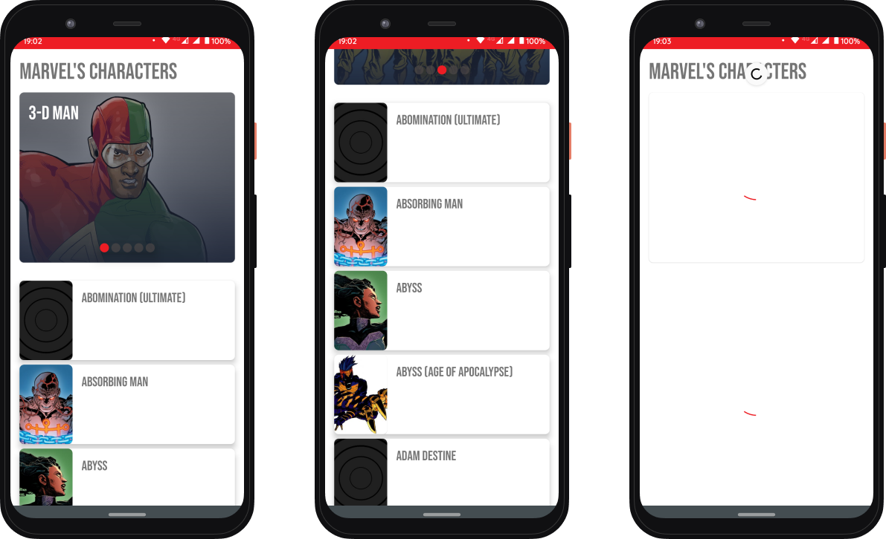

 

  <h3 align="center">Marvel's Characters</h3>

  <a href="#seed-fluxos">Fluxo</a>&nbsp;&nbsp;&nbsp;|&nbsp;&nbsp;&nbsp;
  <a href="#rocket-tecnologias">Tecnologias</a>&nbsp;&nbsp;&nbsp;|&nbsp;&nbsp;&nbsp;
  <a href="#memo-licença">Roadmap</a>

  

 
##🌱Fluxo

Eu dividi o fluxo utilizando o kaban+trello, separei as tarefas em cards e coloquei checklists com as "Definitions of Ready" do que eu preciso fazer para a determinada tarefa:

* Listar os requisitos.
* Criar o trello com todos os requisitos.
* Puxar os cards na ordem que fazia sentido/prioridade 
* Setup do projeto(arquiteturam injeção de dependencias e principais libs) -> setup dos services(autenticão com api e mapeamento de models) -> carrousel -> lista -> taratamento de erros -> scroll infinito -> testes unitarios/integração -> Ultima checada em tudo -> escrever a documentação INCEPTION HAHA -> Fazer pull request -> [THE END]

##🚀Tecnologias
Esse projeto foi desenvolvido com as seguintes tecnologias:

* <b><a href="https://square.github.io/retrofit/">Retrofit2</a></b> - Escoli porque é o a lib padrão pra usar http no android e o que eu uso.
* <b><a href="https://dagger.dev/hilt/">Hilt(Dagger2)</a></b> - Escoli o hilt porque, oferecia um jeito padrão de usar o dagger 2 sem todo o boilerplate code.

##🗺️Roadmap
o tempo foi cruel mais eu gostaria de fazer mais algumas coisinhas com esse projeto:

* Refatorar esse design (mudar paleta de cores interação, listagem etc).
* Tela de detalhes dos personagens.
* Collocar um shimmer loading bonito.

---

Feito com ♥ by Vinicius :wave:
