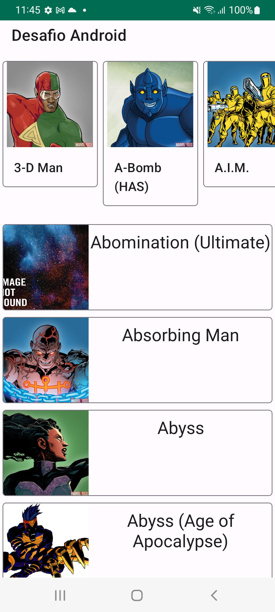

# Desafio Android

é um aplicativo simples que apenas exibe o nome, imagem (se houver) e descrição dos heróis Marvel

## Arquitetura

A divisão principal da arquitetura app é por feature, domain e data

## Responsabilidade dos componentes

- **UI**: é responsavel por exibir os dados do estado da interface para o usuário
- **ViewModel**: é o mantenedor do estado da interface. Ele transforma o dado do domain em um estado, enviando para UI
- **UseCases**: é onde é feito a logica do negocio.
- **Repository**: Controla qual fonte de dados será usada, converte para o modelo Domain
- **DataSources**: é a fonte de dados propriamente dita
## Tecnologias usadas

- Jetpack Navigation v2.3.5
- Jetpack Lifecycle v2.4.1
- Kotlin Coroutines v1.3.9
- Kotlin Flow 
- Jetpack Room v2.4.3
- Hilt v2.38.1
- Retrofit v2.9.0
- Mockito v3.11.2
- Turbine v0.7.0
- MockWebServer v4.9.3

## Roadmap

- Adicionar uma tela de detalhes

- Exibir filmes e seriados onde os personagens aparecem

